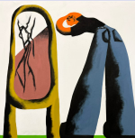

<center>

# **Dainos zodziai:**
> # **The Story So Far "I Want To Disappear" "Letterman**</center>
>
>```
> Look behind me then you'll understand
> I'm not hiding any other man
> To be honest I don't understand
> How you spin me like a ceiling fan
> (Just like a ceiling fan)
>```
>```
> There's no point in making nice
> I know the price
> 'Cause I know all about the down and out, I get it
> 'Cause even if I close my eyes and fantasize
> It's never gonna help me admit that you're gone and to just accept it
>```
>```
> Wear your pride just like a letterman (Just like a letterman)
> Wrap me tight, I'm your rubber band, man (I'm your rubber band, man)
> I won't try you even though I can (Even though I can)
> Slide on by without a second glance (Second glance)
>```
>```
> There's no point in making nice
> I know the price
> 'Cause I know all about the down and out, I get it
> 'Cause even if I close my eyes and fantasize
> It's never gonna help me admit that you're gone and to just accept it
>```
>```
> So don't think that I'm excited at all
> And you know that I've been dying to call
> But I can't get involved
> I don't wanna be here at all (Don't wanna be here at all)
> Do you notice at all?
>```
>```
> Wear your pride just like a letterman (Just like a letterman)
> Wrap me tight, I'm your rubber band, man (I'm your rubber band, man)
> I won't try you even though I can (Even though I can)
> Slide on by without a second glance (Second glance)
>```
>```
> There's no point in making nice
> I know the price
> 'Cause I know all about the down and out, I get it
> 'Cause even if I close my eyes and fantasize
> It's never gonna help me admit that you're gone and to just accept it
> (I know that you're gone and I can't forget it)
> Admit that you're gone and just accept it
>```
<center>

# **Vaizdo irasas**: 
[!](https://www.youtube.com/watch?v=G4lG9wIVlZQ)
#  [**ATGAL**](../contents.md)</center>