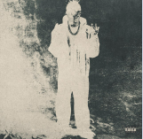

<center>

# **Dainos zodziai:**
> # **Peso Pluma "ÉXODO" "ME ACTIVO"**</center>
>
>```
> Se siguen contando los billetes
> Aparte, todavía tenemos gente
> Se siguen mandando los paquetes
> Hacia otros continentes
>```
>```
> Con un Jungle Boys
> Color negro el Rolls-Royce, bien ido
> Perdiendo el control
> Llenando el mochilón, me activo
>```
>```
> ¡Uh!
> Así nomás, compa Jasiel
> Lo volvimos a hacer, viejo
> ¡Chau!
> Y ya sabe qué show
> Así suena la Doble P, viejo
>```
>```
> Sé que me miran y se preguntan cómo fue
> Tal vez sea porque subí de nivel
> Porque ahora el barco ya lo nivelé
> Y eso le duele a uno, dos que tres
>```
>``` 
> Pero no le pensamos ya bajar
> Porque ahora de espantos ya me sé yo curar
> Así que puro pa' adelante, pa
>```
>```
> Ya, anda alegre la plebada
> Anda al cien el chamaquito
> Sigue tronando las pacas
>```
>```
> Ah, y la motita nunca le falta
>```
<center>

# **Vaizdo irasas**: 
[](https://www.youtube.com/watch?v=xxjmbR3O2KI)
#  [**ATGAL**](../contents.md)</center>